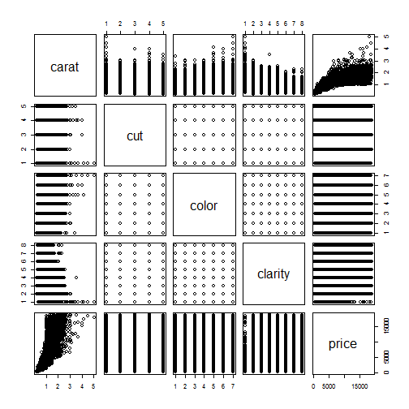

Developing Data Products Week4 Course Project
========================================================
author: ACrst
date: 26 April 2019
autosize: true

Introduction
========================================================

This is a presentation based on Rstudio Shiny appilcation developed as part of Week4 Course Project in Developing Data Products.

The relationship between the price of diamonds varies with its various component characteristics. It not only depends on the weight or carats, but also depends on other features like a diamond's cut, clarity  and color.
- Cut:quality of diamond (IDEAL, PREMIUM, VERY GOOD, GOOD, FAIR)
- Color: best (D) to worst (J)
- Clarity:how clear the diamond is from best to worst (IF, VVS1, VVS2, VS1, VS2, SI1,SI2, I1)

This Shiny app will predict the price of a diamond based on your input of these factors.

Documentation
========================================================

A summary of the diamonds dataset is as shown below. These factors were observed in over 50000 diamonds.


```
Classes 'tbl_df', 'tbl' and 'data.frame':	53940 obs. of  5 variables:
 $ carat  : num  0.23 0.21 0.23 0.29 0.31 0.24 0.24 0.26 0.22 0.23 ...
 $ cut    : Ord.factor w/ 5 levels "Fair"<"Good"<..: 5 4 2 4 2 3 3 3 1 3 ...
 $ color  : Ord.factor w/ 7 levels "D"<"E"<"F"<"G"<..: 2 2 2 6 7 7 6 5 2 5 ...
 $ clarity: Ord.factor w/ 8 levels "I1"<"SI2"<"SI1"<..: 2 3 5 4 2 6 7 3 4 5 ...
 $ price  : int  326 326 327 334 335 336 336 337 337 338 ...
```


Operations of the Shiny App and Output
========================================================

The reactvity of the shiny application plot is controlled by the various user inputs cut, color and clarity.
Bassed on the selected user inputs of the above features, the application predicts the variation in the price of diamond when each of these factors, color, cut and clarity are varied. The variations are shown on the Price- Carat relationship on the diamond dataset.

Links:
- shiny app: https://acrstc.shinyapps.io/MyDvlpDataAssignment/
- source code: https://github.com/ACrst/dvldatassignment4

A simple Summary plot of the diamond data with each of the feature variables plotted 
========================================================



